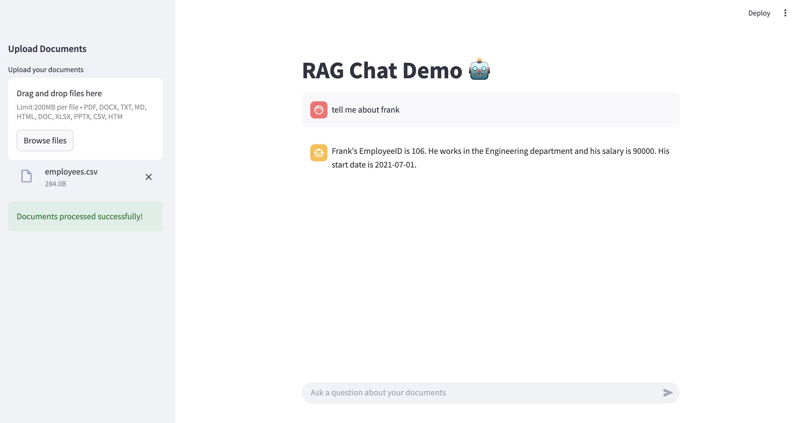

# RAG Chat Demo

A Retrieval-Augmented Generation (RAG) demo application built with LangChain and Streamlit. This application allows you to upload various types of documents and chat with them using Google's Gemini AI.

## Features

- Support for multiple file types:
  - PDF
  - Word documents (DOCX, DOC)
  - Text files (TXT)
  - Markdown (MD)
  - HTML
  - Excel (XLSX)
  - PowerPoint (PPTX)
- Interactive chat interface
- Document processing and vector storage
- Conversation memory

## Setup

1. Clone this repository
2. Install the required dependencies:
   ```bash
   pip install -r requirements.txt
   ```
3. Create a `.env` file in the root directory with your Google API key:
   ```
   GOOGLE_API_KEY=your_api_key_here
   ```

## Usage

1. Run the Streamlit application:
   ```bash
   streamlit run app.py
   ```
2. Upload your documents using the sidebar
3. Once documents are processed, you can start chatting with them
4. Ask questions about the content of your uploaded documents

## How It Works

1. Documents are uploaded and processed using appropriate loaders based on file type
2. Text is split into chunks and converted into embeddings using Gemini's embedding model
3. A vector store is created using FAISS
4. A conversational retrieval chain is set up with Gemini Pro
5. The chat interface allows you to ask questions about your documents

## Requirements

- Python 3.8+
- Google API key
- Required Python packages (see requirements.txt)

## Snapshots

